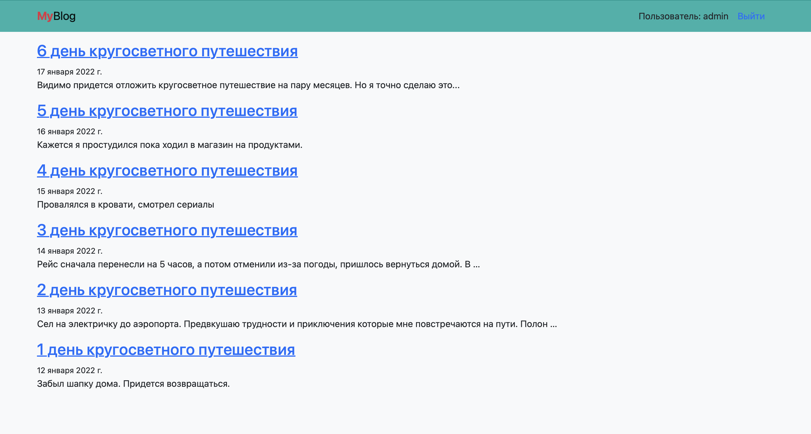

# NewsPortal



## Описание

NewsPortal - это вебсайт для публикации новостей или ведения блога с возможностью зарегистрированным пользователям оставлять комментарии. Публикации создаются только через панель администратора.

Сервис написан на Django с использованием шаблонов и bootstrap. Покрыт тестами Pytest и Unittests.

## Установка

#### 1. Клонируйте репозиторий и перейдите в директорию backend проекта NewsPortal. Создайте виртуальное окружение и активируйте его.
```bash
python3 -m venv venv

source venv/bin/activate
```

#### 2. Установите зависимости из файла requirements.txt в виртуальное окружение Django:
```bash
pip install -r requirements.txt
```

#### 3. Выполните миграции и создайте суперюзера из директории с файлом manage.py:
```bash
# Примените миграции.
python3 manage.py migrate

# Создайте суперпользователя.
python3 manage.py createsuperuser
```

##  Запуск тестов

#### 1. Запуск Unittest

```bash
python manage.py test tests/
```

#### 2. Запуск Pytest

В терминале в корне проекта выполнить команду:
```bash
pytest
```
